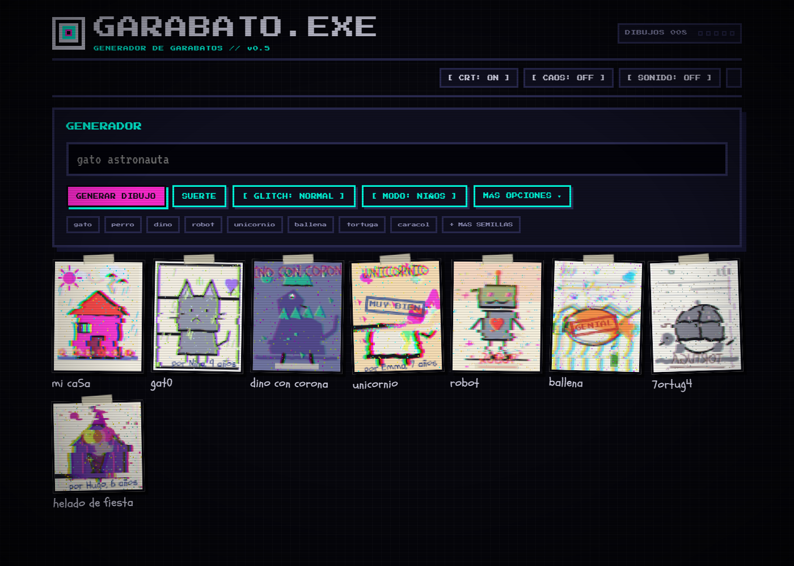
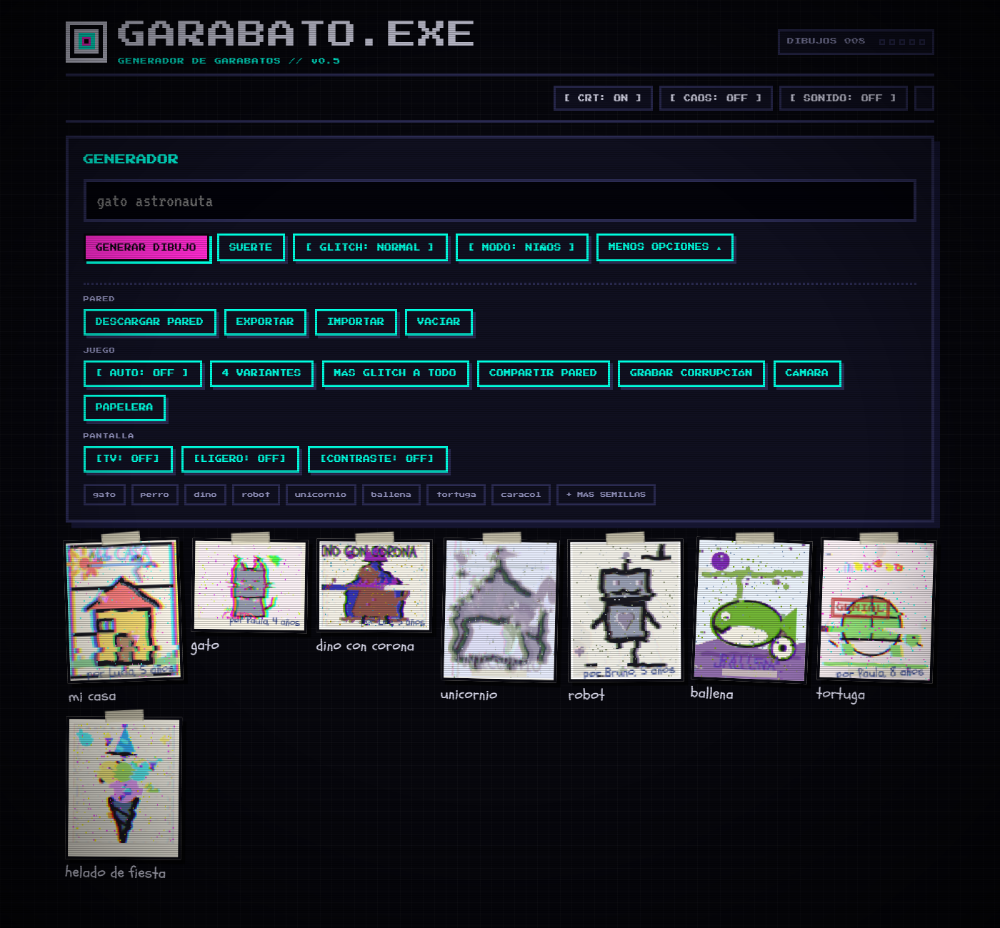
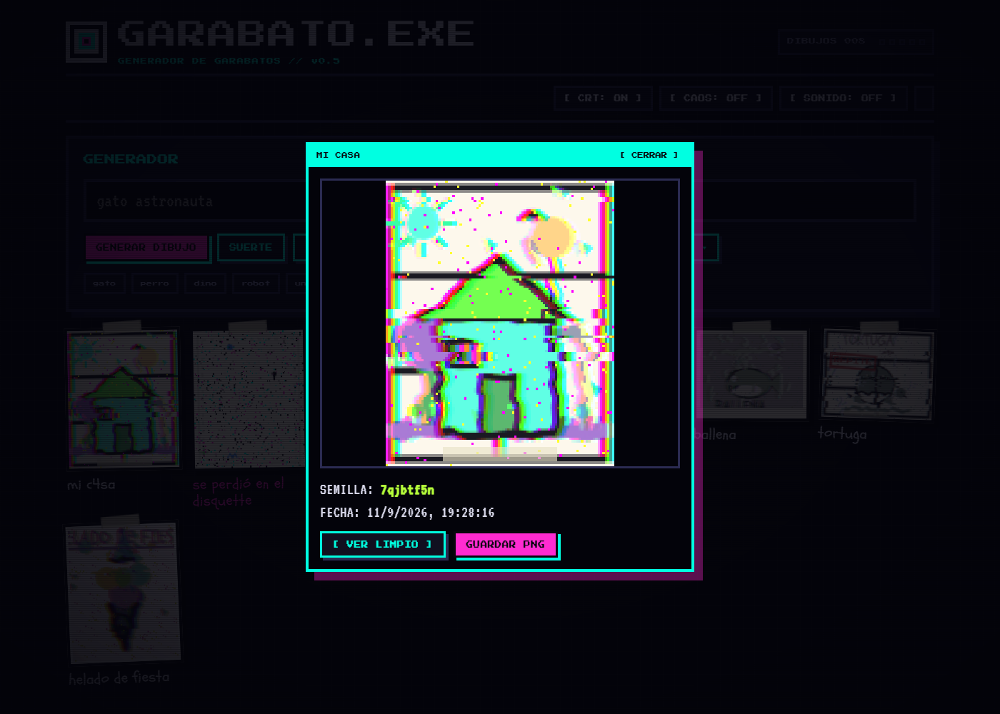
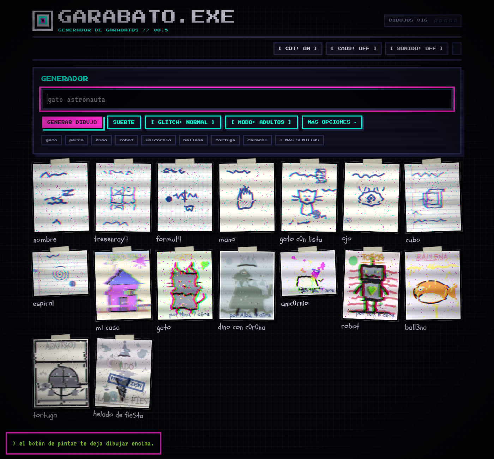
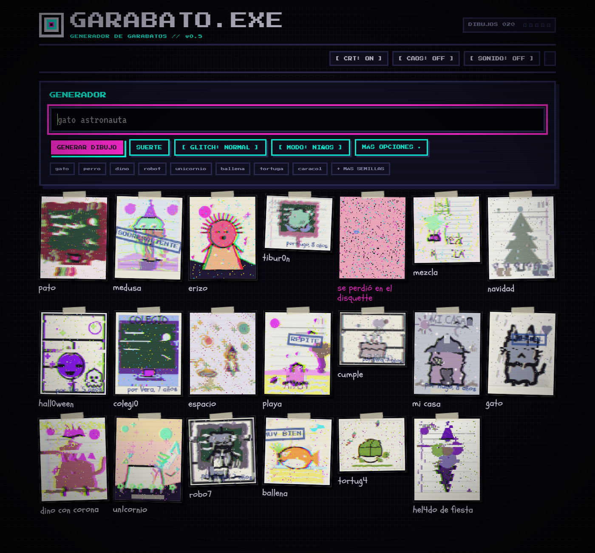

# GARABATO.EXE

**Generador de garabatos.**

Generador net.art de dibujos de niños procedurales: escribes una palabra, se genera un garabato, se corrompe a propósito y se guarda en una pared local. HTML/CSS/JS puro: sin dependencias, sin servidor, sin cookies, sin analítica.

```
   .----------------.
   | GARABATO.EXE   |
   | > garabato: ON |
   | > papel: infinito
   '----------------'
```

## Qué es

GARABATO.EXE es un experimento de arte generativo y net.art. Los dibujos no se suben ni se descargan de ningún sitio: se dibujan en vivo en el navegador con Canvas a partir de una semilla de texto. El estilo mezcla dibujo infantil, píxel art y glitch; el resultado se corrompe a propósito.

## Capturas











## Cómo se usa

- Abre `index.html` en un navegador moderno. No hace falta build, servidor ni instalar nada.
- Escribe una palabra o frase y pulsa **GENERAR DIBUJO**. Ideas: `gato robot con corona`, `dino en la nieve`, `pirata con espada en la playa`, `quimera`, `hada con varita en el colegio`.
- Cada generación se guarda en tu navegador: la pared sigue ahí cuando vuelvas.
- Para publicarlo, sirve la carpeta con cualquier servidor estático. En GitHub Pages: **Settings → Pages → Deploy from a branch → main / (root)**.

## Qué hace

- **54 sujetos** dibujados por código, más **quimeras por partes**: 35 cabezas × 20 cuerpos × 14 fondos.
- **8 perfiles de trazo**: niño pequeño, aplicado, cansado, nervioso, zurdo, pulcro, coloreador y minimalista. Cambian temblor, grosor, presión y densidad de relleno de todos los dibujos.
- **6 papeles**: clásico, cartulina de color, folio arrugado, hoja de examen, servilleta y hoja de cómic.
- **3 formatos**: vertical, apaisado y cuadrado, que rompen la cuadrícula de la pared.
- **Dos modos**: NIÑOS (crayón, colores, fondos y firmas) y ADULTOS (boli azul sobre papel de cuaderno: línea suelta, garabatos de aburrimiento, listas tachadas y texto ilegible). El modo se guarda en cada dibujo.
- **Modo mezcla**: dos estilos conviviendo en la misma hoja, mitad crayón y mitad boli.
- **Escenas temáticas**: cumpleaños, playa, espacio, colegio, halloween y navidad, con varias piezas por escena.
- **Temporada automática**: algunos dibujos salen con motivos de la estación según la fecha (35% de probabilidad).
- **18 accesorios**, 14 fondos, 6 climas, 4 marcos, 6 tintes × 5 modos de color, espejo horizontal, rótulo manuscrito con letra escolar, firmas («por Lucía, 7 años») y sellos de profesor.
- **Corrupción de escáner roto**: datamosh, canales RGB desplazados, pixel sort, bloques permutados y ruido de píxeles.
- **Linaje**: mutar un dibujo engendra variantes con generación (`g1`, `g2`…) y padre registrado.
- **Pintar encima**: editor pixel con paleta, deshacer y guardado; la tinta se funde con el glitch.
- **Pared viva**: reordenar arrastrando, fijar arriba, papelera con rescate, y zoom con ficha (semilla, fecha, generación, linaje).
- **4 variantes a elegir**, auto-generación, y **cámara de vigilancia** a pantalla completa.
- **Compartir la pared por URL** (sin servidor) y **exportar/importar** la colección en JSON.
- **Descargar póster PNG** con toda la pared y **grabar la corrupción** en vídeo si el navegador lo permite.
- Modos **TV**, **ligero** y **alto contraste**, sonido 8-bit opcional y consola de comandos.

## Controles

- En cada dibujo: `✎` pintar, `M` mutar, `P` fijar, `Z` zoom, `X` papelera. Un clic en el propio dibujo lo corrompe.
- Teclado: `Tab` navega los dibujos, `Enter` abre el zoom, la tecla `` ` `` abre la consola y `Escape` cierra modales y cámara.
- Consola: `generar <texto>`, `suerte`, `glitch`, `limpiar`, `bajar`, `caos`, `crt`, `sonido`, `ayuda`.
- Los botones menos usados viven en **MÁS OPCIONES**, agrupados en PARED, JUEGO y PANTALLA.

## Cómo funciona por dentro

- Cada dibujo es un canvas de 96×120 píxeles escalado con `image-rendering: pixelated`.
- El azar es determinista: PRNG mulberry32 sembrado con un hash FNV del texto. La misma semilla produce siempre el mismo dibujo.
- El render va por lotes con caché por semilla, así la pared aguanta cientos de dibujos sin tirones.
- La corrupción se hace manipulando `ImageData` directamente (desplazar filas, intercambiar canales, ordenar píxeles por brillo, permutar bloques).
- Las tipografías (Press Start 2P, VT323 y Schoolbell) van embebidas en base64 dentro del CSS, bajo licencia SIL OFL: el sitio funciona igual sin conexión.
- Sin frameworks, sin build, sin peticiones de red.

## Privacidad

Todo ocurre en tu navegador. No hay cookies, ni analítica, ni llamadas a servidores. Tus dibujos se guardan en `localStorage`; si borras los datos del navegador se van, y por eso existen EXPORTAR e IMPORTAR.

## Estructura

```
index.html        la galería y el generador
css/estilo.css    estilos CRT/pixel + tipografías embebidas
js/galeria.js     motor generativo: dibujos, glitch, pared, modales
js/zetetica.js    atmósfera: CRT, caos, lluvia, sprites, consola
_blog_antiguo/    archivo del proyecto anterior (blog zetético)
```

## Estado

Experimento en desarrollo. Puede tener fallos.

## Licencia

- **Código** (HTML, CSS y JavaScript): licencia MIT, ver [LICENSE](LICENSE).
- **Obra** (dibujos generados, textos e identidad visual): [CC BY-NC 4.0](https://creativecommons.org/licenses/by-nc/4.0/): puedes compartir y adaptar dando crédito, sin uso comercial.
